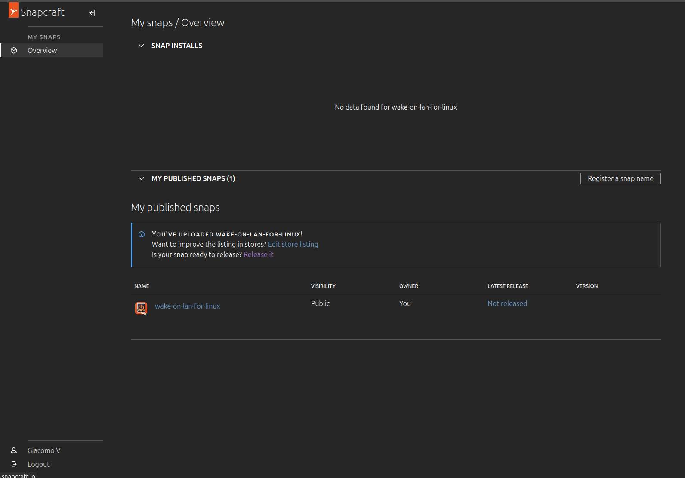
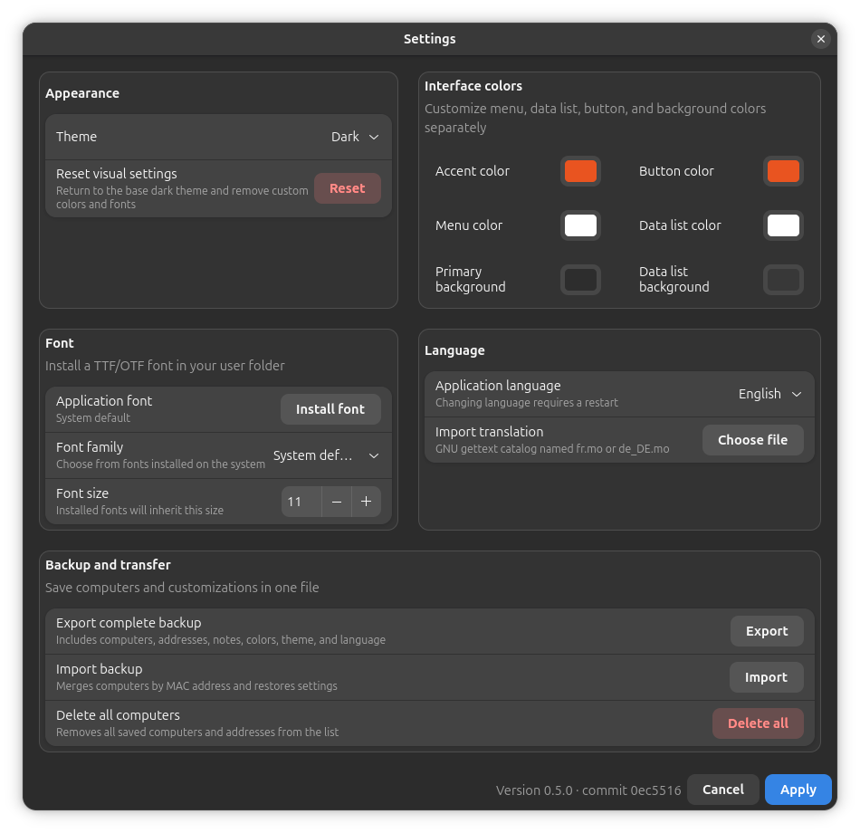
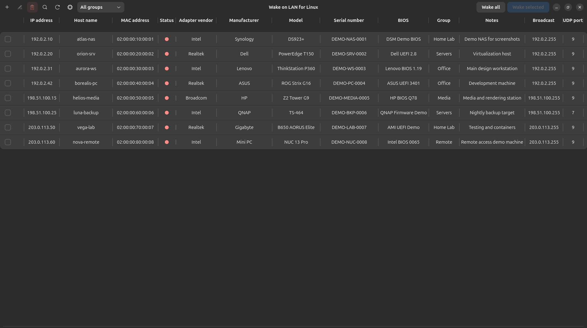

# Wake on LAN for Linux

[](https://github.com/Hyperboreus85/wake-on-lan-for-linux/actions)
[](LICENSE)
[](https://github.com/Hyperboreus85/wake-on-lan-for-linux)

A modern GTK 4 / Libadwaita desktop application for discovering, organizing, monitoring, and waking computers on a local network.


## What it does

Wake on LAN for Linux keeps your network computers in one clear, searchable list. Add devices manually or discover them on the local IPv4 subnet, inspect their current status, and wake one or many machines with a single action.

The application is designed for Ubuntu and other Linux desktops, with a native dark/light interface, Italian and English translations, and portable backups for moving your setup to another computer.

## Features

- Add, edit, and remove computers.
- Store IPv4 address, MAC address, broadcast address, UDP port, vendor, model, serial number, BIOS, group, and notes.
- Wake one computer, several selected computers, or the entire list.
- Protect bulk wake operations with three consecutive confirmation dialogs.
- Scan the detected local IPv4 subnet and choose which discovered devices to import.
- Resolve hostnames through local DNS, mDNS, `/etc/hosts`, Avahi, and NetBIOS fallbacks.
- Check and display device status with clear LED indicators.
- Sort saved computers by the numeric value of their IPv4 address.
- Choose system, light, or dark theme plus five accent colors.
- Use the interface in Italian or English.
- Export and import complete portable backups, including devices, preferences, column widths, and custom translations.
- Merge imported devices by normalized MAC address without creating duplicates.
- Normalize common MAC address formats.
- Keep application data in the XDG data directory, outside the source tree.

## Screenshots

### Computer list



### Settings and appearance



### Empty state



## Installation

### Ubuntu development setup

Clone the project and run the bootstrap script:

```bash
git clone https://github.com/Hyperboreus85/wake-on-lan-for-linux.git
cd wake-on-lan-for-linux
./scripts/bootstrap-ubuntu.sh
./run.sh
```

The bootstrap script installs the packages required by GTK, networking and hostname discovery, compiles translations, creates a Python virtual environment, and installs the application launcher.

### Snap package

The repository includes a strict-confinement Snap recipe in `snap/snapcraft.yaml`. Pushes to `main` build a test package through GitHub Actions; the resulting `.snap` file is published as a workflow artifact.

When the Snap Store release is available, install it with:

```bash
sudo snap install wake-on-lan-for-linux
```

For testing an unreleased edge build:

```bash
sudo snap install wake-on-lan-for-linux --edge
```

## Backup and transfer

Open **Settings → Backup and transfer** to export a complete portable backup. The backup can contain:

- saved computers and network addresses;
- appearance, theme, font, and column-width settings;
- language and translation catalogs.

The JSON backup is readable and editable. The encrypted `.wolbackup` format protects the same data with Scrypt and AES-256-GCM.

Treat backups as private data: they may contain IP addresses, MAC addresses, serial numbers, BIOS information, and notes.

## Working from `/opt`

To install this checkout as a user-owned development copy:

```bash
./scripts/install-worktree-to-opt.sh
cd /opt/wake-on-lan-for-linux
./scripts/bootstrap-ubuntu.sh
```

The helper uses `sudo` only when creating the directory and assigning its ownership. Do not run the application itself with `sudo`.

## Translations

Italian is the source language and English is bundled. Additional GNU gettext `.mo` catalogs can be imported from **Settings**.

Developers can rebuild the bundled catalogs with:

```bash
./scripts/compile-translations.sh
```

## Tests

Run the complete test suite with:

```bash
./scripts/test.sh
```

## Project status

Wake on LAN for Linux is under active development. The current 0.5 release focuses on reliable device management, local-network discovery, complete backup and restore, appearance customization, translations, and Snap packaging.

Bug reports and feature requests are welcome in [GitHub Issues](https://github.com/Hyperboreus85/wake-on-lan-for-linux/issues).

## License

This project is licensed under the [GNU General Public License v3.0 or later](LICENSE).
